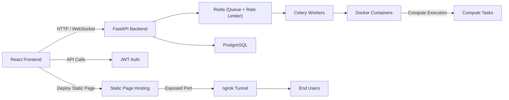

# 🚀 CloudFlow - GPU & Compute Management Dashboard


---

## 🔥 Overview

CloudFlow is a modern GPU and compute task management platform with real-time monitoring, task queueing, rate-limiting, and isolated Docker-based compute environments. It allows developers to:

- Launch compute tasks with CPU/GPU selection.
- Monitor real-time GPU/CPU/memory usage.
- View logs live via WebSockets.
- Download artifacts from completed tasks.
- Host static websites.
- Implement task queuing and rate limiting for stable multi-user operations.

---

## 🛠 Tech Stack

- **Frontend:** React + TailwindCSS + Framer Motion
- **Backend:** FastAPI
- **Task Queue & Rate Limiter:** Redis + Celery
- **Compute Isolation:** Docker Containers
- **Real-time Monitoring:** WebSockets
- **Authentication:** JWT-based
- **Hosting / Deployment:** Optional via Cloudflare Tunnels / Docker

---

## ⚡ Features

- ✅ Start compute tasks with customizable CPU/GPU resources.
- ✅ Live GPU/CPU/memory monitoring dashboard.
- ✅ WebSocket logs streaming for running tasks.
- ✅ Download artifacts from completed tasks.
- ✅ Queueing & rate-limiting using Redis + Celery.
- ✅ Isolated compute environments using Docker.
- ✅ Task history with status (Running / Completed / Stopped).
- ✅ Static website hosting & containerized app deployment.
- ✅ Modern responsive UI with Tailwind + Framer Motion.

---

## 🏗 Architecture


---

# ⚙️ Setup

## Install Dependencies
### Backend

``` 
bash
git clone <repo-url>
cd backend
python -m venv venv
source venv/bin/activate
pip install -r requirements.txt
``` 

### Frontend

``` 
bash
cd frontend
npm install
``` 
### Redis

Ensure Redis is running locally or via Docker.

### Running All Services
The codebase provides a single build script start.sh to run backend, frontend, and Celery workers:

Auto-restarts any service if it crashes

Tracks child PIDs and kills all on Ctrl+C

```
chmod +x build.sh
./build.sh
```

---

## 💡 Usage

- Open frontend at `http://localhost:5173`
- Start new compute tasks with Docker image and command.
- Monitor live GPU/CPU/memory stats.
- View logs or download artifacts when tasks complete.
- Tasks exceeding rate limit will queue automatically.

---

## 🌐 Real-time Monitoring

- GPU usage plotted live with WebSockets.
- CPU and memory usage visible in dashboard.
- Task logs streamed in real-time for debugging.

---

## 🔒 Security & Rate Limiting

- Redis used to enforce per-user rate limiting.
- Celery task queue ensures tasks are processed sequentially if limits exceed.
- JWT authentication for secure API access.
- Docker containers isolate compute tasks to avoid system-level conflicts.

---

## 📌 Notes

- Recommended: 16GB RAM + 4 cores for local testing.
- Docker must be installed for task execution.
- Redis required for Celery queueing & rate limiting.
- Frontend uses WebSockets for live GPU/CPU/memory updates.


